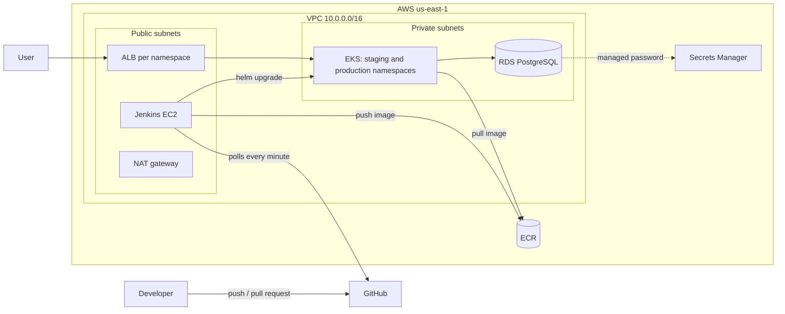

# DevOps Assignment: EKS, RDS, Jenkins CI/CD and Observability

A demo Flask + PostgreSQL application deployed on AWS. Infrastructure is built with Terraform, the app is built, scanned and deployed by Jenkins, and the platform is monitored with Prometheus, Grafana and Loki.

- Approach and decisions: [docs/approach.md](docs/approach.md)
- Challenges faced and how they were solved: [docs/challenges.md](docs/challenges.md)
- Screenshots: [docs/screenshots/](docs/screenshots/)

## 1. Requirements coverage

| Requirement | Where it is implemented |
|---|---|
| VPC with public and private subnets | `modules/vpc` |
| EKS for application hosting | `modules/eks` |
| RDS PostgreSQL | `modules/rds` |
| Security groups with appropriate rules | `modules/rds`, `modules/jenkins`, EKS module groups, one rule in `environments/staging/main.tf` |
| Load balancer for the frontend | AWS Load Balancer Controller (`environments/staging/lb-controller.tf`) creates an ALB from the Ingress in `deploy/chart` |
| `variables.tf` for configurable parameters | `environments/staging/variables.tf` and each module's `variables.tf` |
| State management | S3 backend, versioned, encrypted, with native locking |
| Outputs for key resources | `environments/staging/outputs.tf` |
| CI/CD pipeline | `Jenkinsfile` (Multibranch Pipeline) |
| Tests on PR | Unit and integration tests run on every pull request build |
| Build and push on merge to main | `Push to ECR` stage, `main` only |
| Deploy to staging | `Deploy to staging` stage |
| Manual approval for production | `input` step before `Deploy to production` |
| Vulnerability scans | `pip-audit` (dependencies) and Trivy (container image) |
| Notify on failure | Email through the Extended E-mail plugin (Gmail SMTP) |
| Infrastructure metrics | kube-prometheus-stack (node exporter, kube-state-metrics, cAdvisor) |
| Application metrics | `/metrics` endpoint scraped through a ServiceMonitor |
| Database metrics | postgres-exporter |
| Centralized logging | Loki and Promtail |
| Two dashboards | `monitoring/dashboards/` |
| Secret management | RDS-managed password in AWS Secrets Manager, Jenkins credential store, sensitive Terraform variables |
| Backup strategy | RDS automated backups (7 days), S3 state versioning |

## 2. Architecture



| Layer | Details |
|---|---|
| Network | VPC `10.0.0.0/16`, 2 availability zones, 2 public and 2 private subnets, one NAT gateway |
| Compute | EKS cluster with a managed node group (2 x t3.medium, scaling 1 to 3). Nodes are in private subnets. Staging and production are separate namespaces |
| Database | RDS PostgreSQL 16, `db.t3.micro`, encrypted storage, private subnets, reachable only from the EKS node security group |
| Registry | ECR with scan on push |
| Load balancer | AWS Load Balancer Controller (Helm, with an IRSA role) creates one internet-facing ALB per Ingress |
| CI/CD | Jenkins on EC2 (t3.medium, 30 GB encrypted gp3). Administrative access only through AWS Systems Manager |
| Observability | Prometheus, Grafana, Alertmanager, Loki, Promtail, postgres-exporter |

## 3. Repository layout

```
app/                Flask app, unit and integration tests, Dockerfile
deploy/             Helm chart for the app, values per environment
modules/            Terraform modules: vpc, eks, ecr, rds, jenkins
environments/
  staging/          Terraform root module (cluster add-ons, monitoring, logging)
monitoring/
  dashboards/       Grafana dashboards as JSON
scripts/            One-time bootstrap for the Terraform state bucket
docs/               Approach, challenges, screenshots
Jenkinsfile         CI/CD pipeline
```

## 4. Prerequisites

- AWS account and CLI configured, region `us-east-1`
- Terraform 1.10 or newer (native S3 state locking)
- kubectl, Helm 3, Docker, Python 3
- AWS Session Manager plugin (for Jenkins access)
- A GitHub personal access token with `repo` scope
- A Gmail address and Gmail App Password (for failure emails)

## 5. How to set up and run

### 5.1 State bucket (one time)
Terraform cannot create its own backend bucket, so this is a small script outside Terraform.
```bash
./scripts/create-state-bucket.sh        # prints the bucket name
cd environments/staging
```

### 5.2 Variables
Create `environments/staging/terraform.tfvars` (it is git-ignored):
```hcl
allowed_ip             = "<your public IPv4>/32"   # curl -4 ifconfig.me
grafana_admin_password = "<strong password>"
```

### 5.3 Infrastructure, in phases
The Helm and Kubernetes resources need the cluster to exist, so build in phases.
```bash
terraform init -backend-config="bucket=<bucket-from-5.1>"
terraform apply -target=module.vpc -target=module.eks -target=module.rds -target=module.ecr
```

### 5.4 Namespaces and database secret
```bash
aws eks update-kubeconfig --region us-east-1 --name devops-staging-staging-eks

SECRET_ARN=$(terraform output -raw rds_secret_arn)
DB_HOST=$(terraform output -raw rds_endpoint | cut -d: -f1)
SECRET_JSON=$(aws secretsmanager get-secret-value --secret-id "$SECRET_ARN" --query SecretString --output text)
DB_USER=$(echo "$SECRET_JSON" | python3 -c "import sys,json; print(json.load(sys.stdin)['username'])")
DB_PASSWORD=$(echo "$SECRET_JSON" | python3 -c "import sys,json; print(json.load(sys.stdin)['password'])")

for NS in staging production; do
  kubectl create namespace "$NS" --dry-run=client -o yaml | kubectl apply -f -
  kubectl create secret generic db-credentials --namespace "$NS" \
    --from-literal=DB_HOST="$DB_HOST" --from-literal=DB_PORT=5432 \
    --from-literal=DB_NAME=appdb --from-literal=DB_USER="$DB_USER" \
    --from-literal=DB_PASSWORD="$DB_PASSWORD" --dry-run=client -o yaml | kubectl apply -f -
done
```

### 5.5 Rest of the platform
```bash
terraform apply
```
This installs the load balancer controller, Jenkins, monitoring, logging and the PostgreSQL exporter.

### 5.6 Jenkins
1. `aws ssm start-session --target $(terraform output -raw jenkins_instance_id)`, then read `/var/lib/jenkins/secrets/initialAdminPassword`.
2. Open `http://<jenkins_public_ip>:8080` (restricted to `allowed_ip`), install the suggested plugins.
3. Add credentials: `github-pat` (username and token) and `gmail-smtp` (Gmail address and App Password).
4. Configure **Extended E-mail Notification**: `smtp.gmail.com`, port 465, SSL, credentials `gmail-smtp`. Set the System Admin e-mail address.
5. Set `NOTIFY_EMAIL` and the AWS account, region and cluster values at the top of the `Jenkinsfile`.
6. Create a **Multibranch Pipeline** job: GitHub source with `github-pat`, script path `Jenkinsfile`, scan trigger every 1 minute.

### 5.7 Dashboards
```bash
kubectl port-forward svc/monitoring-grafana -n monitoring 3000:80
```
In Grafana, go to Dashboards, New, Import, and upload the two files in `monitoring/dashboards/`. Select the Prometheus and Loki data sources.

### 5.8 Clean up
Remove the apps first, so the load balancer controller deletes its own ALBs, then destroy:
```bash
helm uninstall demo-app -n staging
helm uninstall demo-app -n production
kubectl get ingress -A          # wait until empty and ALBs are gone
terraform destroy
```
Then empty and delete the state bucket (it is versioned, so delete all object versions first).

## 6. CI/CD pipeline

| Event | Stages |
|---|---|
| Pull request | Prepare, unit tests, integration tests (real PostgreSQL in a container), dependency scan, build image, container scan |
| Merge to `main` | All of the above, then push to ECR, deploy to `staging`, manual approval, deploy to `production` |
| Any failure | Email notification |

- Images are tagged with the short Git commit SHA.
- Helm uses `--wait` and the pipeline checks `kubectl rollout status`.
- Jenkins polls GitHub every minute, so no inbound port needs to be open to GitHub.

Screenshots: `docs/screenshots/jenkins-main-run.png`, `jenkins-approval.png`, `jenkins-pr-run.png`.

## 7. Monitoring and logging

- **Metrics:** Prometheus scrapes nodes, Kubernetes objects, the app (`/metrics`) and PostgreSQL. Retention is 3 days.
- **Logs:** Promtail ships all container logs to Loki. Query them in Grafana, for example `{namespace="staging"}` (application and request logs) and `{namespace="kube-system"}` (system logs).
- **Dashboards:**
  1. *Infrastructure Overview*: node CPU, memory, disk, network, pod health, restarts.
  2. *Application and Database*: request rate, error rate, latency percentiles, pod resources, database up, connections, transactions, and an application log panel.

Screenshots: `docs/screenshots/grafana-infrastructure.png`, `grafana-application.png`, `loki-logs.png`, `prometheus-targets.png`.

## 8. Architecture decisions

| Decision | Reason |
|---|---|
| EKS | Managed control plane and matches the Kubernetes tooling I wanted to demonstrate |
| Terraform modules plus one environment folder | Reusable building blocks, and a second environment only needs a new folder |
| Community modules for VPC and EKS | Well-tested for resources that are large and easy to get wrong |
| Helm chart for the app | One template, per-environment values, easy rollback |
| Jenkins on EC2 with a Multibranch Pipeline | Gives PR builds and branch builds from one `Jenkinsfile` |
| Staging and production as namespaces in one cluster | Keeps cost low (see section 10) |
| ALB created by the controller from an Ingress | Standard EKS approach for HTTP load balancing |
| Polling instead of webhooks | No inbound access from GitHub is needed |

## 9. Security considerations

- The database is private and accepts port 5432 only from the EKS node security group.
- The database password is generated by RDS and stored in Secrets Manager. It is never in Git or in Terraform code.
- No static AWS keys anywhere. Jenkins uses an IAM instance role. The load balancer controller uses IRSA.
- No SSH. Administrative access to the Jenkins server is through Systems Manager Session Manager. The Jenkins web port accepts only one IP address.
- The Jenkins IAM role has ECR push access and `eks:DescribeCluster` scoped to this cluster. The role is mapped into Kubernetes through an EKS access entry.
- Terraform state is stored in an S3 bucket with versioning, encryption and all public access blocked, and is locked during runs.
- RDS storage, EBS volumes and EKS secrets are encrypted.
- The container runs as a non-root user. Images are scanned on every build and ECR scans on push.
- Secrets (`terraform.tfvars`, tokens, App Password) are never committed.

## 10. Cost optimization

- One NAT gateway instead of one per availability zone.
- Small instance sizes (`t3.medium` nodes, `db.t3.micro`).
- Single-AZ database, no persistent volumes for Prometheus and Loki.
- Prometheus retention of 3 days.
- Staging and production share one cluster, separated by namespace.
- The whole environment is created for the demo and removed with `terraform destroy`. While running, my estimate is roughly 30 to 50 US cents per hour, mainly EKS, NAT, the nodes, RDS and two ALBs.

## 11. Secret management and backup

- **Secret management:** RDS-managed credentials in Secrets Manager, Jenkins credential store for the GitHub token and the Gmail App Password, sensitive Terraform variables for the Grafana password.
- **Backup:** RDS automated backups with 7-day retention. S3 versioning keeps previous versions of the Terraform state.

## 12. Limitations and what I would change for production

| Current | Production approach |
|---|---|
| One cluster, namespaces for staging and production | Separate clusters and state per environment |
| Single NAT, single-AZ RDS, no final snapshot | NAT per AZ, Multi-AZ RDS, final snapshot, deletion protection |
| DB password copied into a Kubernetes Secret by a command | External Secrets Operator or the Secrets Store CSI driver with IRSA |
| Staging and production use the same database | One database per environment |
| Jenkins builds on the controller and polls GitHub | Separate build agents, webhooks, HTTPS |
| Jenkins has cluster-admin through an access entry | A narrower custom Kubernetes role |
| Exporter uses the RDS master user | A dedicated read-only monitoring user |
| Prometheus and Loki have no persistent storage | EBS volumes, and S3 storage for Loki |
| HTTP on the load balancers | HTTPS with an ACM certificate and a domain |
| Terraform applied by hand | Plan on pull request, apply through a pipeline with approval |
| Public EKS endpoint | Restrict the endpoint to a VPN or CIDR allow-list |